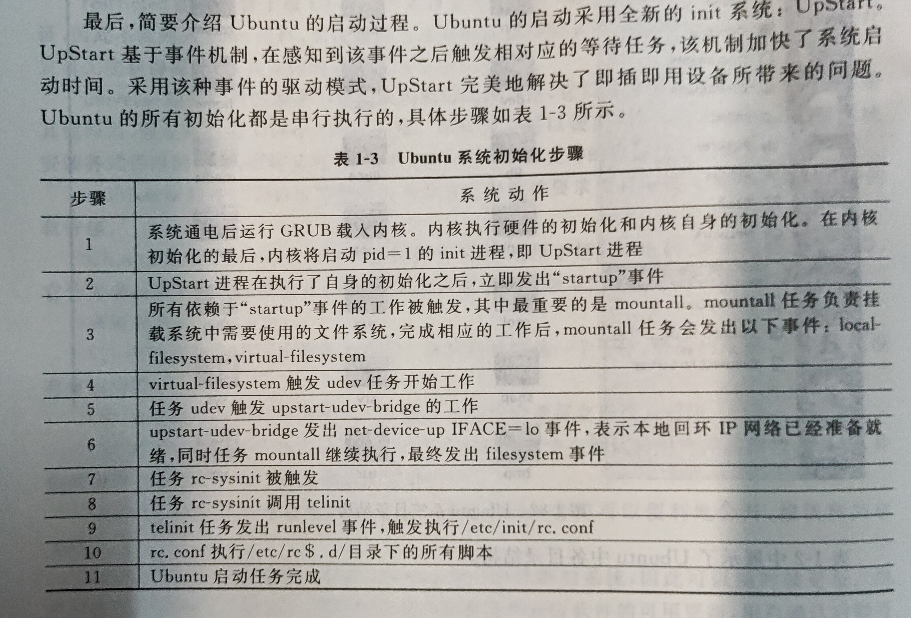

## 第一章

*答案*
*选择题*

<p style="color: deeppink">CBADB</p>

*填空题*
1. <p style="color: deeppink">网络设备驱动程序</p>
2. <p style="color: deeppink">虚拟接口</p>
3. <p style="color: deeppink">/</p>
4. <p style="color: deeppink">/boot</p>
5. <p style="color: deeppink">1991</p>

*简答题*
1. <p style="color: hotpink">从操作系统的角度来看，Linux内核中最为重要的几部分是：进程调度、内存管理、虚拟文件系统和网络接口。其中，进程调度、内存管理和虚拟文件系统组成了基本的操作系统结构，使得用户可以运行程序、管理文件并使用系统。</p>
2. <p style="color: hotpink">（1） 模块化程度高 <br>（2） 源码公开 <br>（3） 设备独立性 <br>（4） 广泛的硬件支持 <br>（5）安全性及可靠性好 <br>（6）可移植性强 <br>（7） 用户界面良好 <br>（8）良好的网络与文件系统支持</p>
3. <p style="color: hotpink">桌面版：<br>（1）安装完毕启动后桌面十分简洁。<br>（2） 安装完毕后可以立刻使用。<br>（3）默认含有用户所需的应用程序。<br>（4）可编辑和共享其他格式的文件。<br>（5）系统升级快速简单。<br>（6）强大的自由软件仓库。<br>（7）触手可及的帮助和支持。</p>
4.  <p style="color: hotpink">服务器版：<br>（1）拥有集成安全的平台。<br>（2）总体拥有成本较低。<br>（3）消除更新个人工作站的成本</p>
5.  <p style="color: hotpink">（1）/ （2）/bin （3）/boot （4）/etc </p>

## 第二章

<p style="color: f05b72">BDDCA&nbsp;&nbsp;&nbsp;&nbsp;CBD</p>


<p style="color: f05b72">AB</p>

*填空题*
1. <p style="color: f05b72">"text"</p>
2. <p style="color: f05b72">管理员</p>
3. <p style="color: f05b72">(题目错了)整句话应该是：<br>在Ubuntu系统中,任何高优先级的软件包都不依赖于低优先级的软件包。</p>
4. <p style="color: f05b72">期望状态</p>
5. <p style="color: f05b72">u</p>
6. <p style="color: f05b72">未安装(Not)</p>
7. <p style="color: f05b72">图形界面</p>
8. <p style="color: f05b72">install</p>
9. <p style="color: f05b72">卸载</p>
10. <p style="color: f05b72">update</p>

*简答题*
1. <p style="color: f05b72">(1) 点击菜单栏中的“Shut down...”子菜单<br>(2) 点击后会弹出对话框，选择"Restart"操作</p>
2. <p style="color: f05b72">(1) OpenOffice <br>(2) Mozilla Firefox Web 浏览器<br>(3) Rhythmbox</p>
3. <p style="color: f05b72">(1) 点击菜单栏中的“Log Out...”子菜单<br>(2) 点击后会弹出对话框，然后点击上锁的图案</p>
4. <p style="color: f05b72">dpkg、apt和aptitude</p>
5. <p style="color: f05b72">前者指用户希望某个软件包处于的状态；后者是用户操作该软件包后的最终状态。</p>

## 第三章


<p style="color: d64f44">BACD</p>


<p style="color: d64f44">5. A<br>6-10: ACACD<br>11-15:BACAA<br>16-20: BDADB</p>


*填空题*

1. root
2. exit
3. adduser
4. pwd
5. cd
6. Ctrl+D
7. 读取
8. Page Up
9. 10
10. diff3
11. mkfs.ext4
12. aquota.group
13. zip
14. bzip2recover
15. uncompress
16. man
17. 1000
18. sudo
19. unalias w
20. adduser user01 sudo

*简答题*

1. 内部命令常驻内存，它们是shell程序的一部分，这些命令由shell程序识别并可在其内部运行；外部命令是Ubuntu系统中的实用程序，它通常不被包含在shell中，和内部命令相比，其使用频率低，因此尽在用户需要使用时才将其调入内存，而不像内部命令那样常驻内存。
2. 不显示。应对当前用户输入密码时旁人偷窥导致的密码泄露问题。
3. （1）在使用 useradd 创建用户时不会在 / home 下自动创建于该账户的用户名同名的用户目录，而且不会自动选择 shell 版本，也不会设置密码，因此这个账户创建后默认是不能被立即使用的，而是需要使用 passwd 修改密码后方可使用。<br>（2）在使用 adduser 创建账户时则不存在上述问题，即账户创建后可以立即被使用。需要特别留意的是，一般用户不具有创建账户的权限，需要使用 root 账户完成上述操作。创建账户完成后，我们就可以使用这个账户的用户名和密码进行登录。
4. （1）执行命令： passwd + 账户名<br>（2）用户输入当前密码，如果密码正确则会提示用户输入新密码，否则会提示用户修改密码失败。<br>（3）若用户输入密码正确，此时要求重复输入两次新密码且新密码不能与原密码相同，否则会提示原密码未被修改，要求用户再次输入新密码。<br>（4）正确完成所有输入后，如果出现 "password updated successfully" 提示，则用户成功修改密码。
5. https://zhuanlan.zhihu.com/p/517559312
6. 创建文件、查看文件和合并文件。
7. （1） less不会一下子加载整个文件，加载速度比more更快。<br>（2）more上下方向键功能为上下翻页，pageUp和pageDown也是翻页，b键可以向上翻页，空格键向下翻页。enter键向下逐行滚动，没有向上逐行滚动功能。<br>（3）less可以按键盘上下方向键逐行滚动内容，pegeUp和pageDown分别为上下翻页，b和空格也可以翻页。斜杠加字符可以搜寻内容中匹配字段，如“/login”寻找login字段，此时按n键定位下一个匹配字段。<br>（4）less退出后不会在终端内留下刚显示的内容，而more退出后会在终端内留下。
8. Diff的全称为“比较文件和目录”，是Unix操作系统的命令行工具，它可以帮助你比较两个或多个文件的差异，你可以使用Diff命令发现文件的不同之处，例如不同的数据、删除的文本或增加的新内容。当我们使用Diff命令比较文件时，它会列出要比较的文件前后发生变化的行，这样可以很容易地增加、编辑或删除这些改变，如下所示：

```
$ diff file1.txt file2.txt   
> Line added in file2.txt
```

以上命令比较此文本文件 file1.txt 和 file2.txt，Diff 命令会显示文件的不同之处，“”分别显示在 file2.txt 中增加和删除的行。

除了使用普通 Diff 命令外，还可以使用更复杂的Diff工具对文件进行比较，例如 diff3 和 sdiff。

– diff3：可以用来比较3个文件，它可以显示任何两个文件之间的任何不同，也可以显示所有3个文件之间的不同，如下所示：

```
$ diff3 file1.txt file2.txt file3.txt
```

– sdiff：用于比较两个文件并合并它们，它将比较结果显示在终端窗口中，你可以使用键盘控制比较的不同部分，如下所示：

```
$ sdiff file1.txt file2.txt   
modified line in file1.txt modified line in file2.txt
```

9. 因为Linux操作系统是多用户多任务的操作操作系统，多个用户共享磁盘空间，而这些资源不是无限使用的。例如，系统中的home目录存放着普通用户的工作目录，假设home目录一共有10GB空间，而home下一共有四个用户，那么正常划分，每个用户应该分得大概2.5GB空间，但是其中有个用户在工作目录下存放了很多音频文件，占了8GB的空间，这对其他用户不公平。
10. （1）root在linux里面拥有所有的系统权限，可以畅行无阻地修改所有系统文件和其他用户的文件，挂载文件系统等等的一系列操作，因为linux内核执行进程的过程中，首先检查进程所属，如果属于root则一切放行。<br>（2）普通用户则有很大的限制，例如不能修改系统关键配置文件，想查看其他用户的文件则需要相应的权限，不能安装软件，甚至关机关机指令都需要以root身份执行。

### 第五章

1. column -x practice050201 | more
2. grep book * 
3. -l
4. $
5. bc
6. quit
7. man ascii
8. 对文件内容反向排序
9. sort +2 -4 practice050209
10. sort -k -t, practice050210
11. diff
12. tr '[a-z]' '[A-Z]' practice050212
13. sed '3d' practice050213
14. NR
15. -v
16. awk '/^[d]/ {print $3}' practice050216
17. FS
18. 换行符
19. -f
20. count=count-price





# Linux和Windows的区别

**免费与收费**

在中国，对个人用户windows和linux都是免费的，对公用户windows需要收费，linux是免费的。

**技术支持**

Windows提供了较完善的帮助系统，而大多数Linux用户依靠技术社区来进行技术支持。他们可以从聊天板和论坛得到有用的信息。缺点是，它往往需要较长时间才能得到答案。

**安全性**

安全是一个非常重要的问题。这两个系统都有漏洞和潜在的安全问题。许多管理员声称，Linux比Windows有更多的漏洞，这当然跟它开源有关。不过，如果你有一个好的管理员，安全应该不是一个重大问题，无论您使用的那种操作系统。

**开源**

开源就是指对外部开放软件源代码。linux开源，而Windows并不开源。
